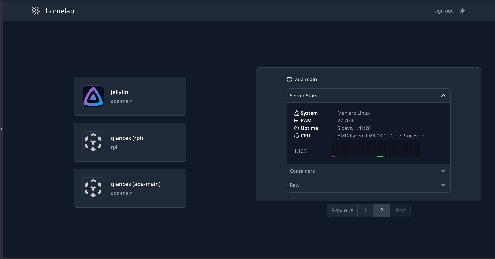
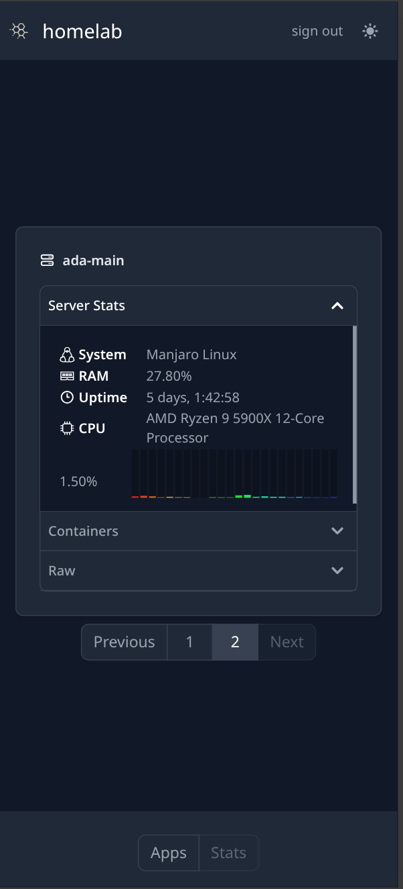
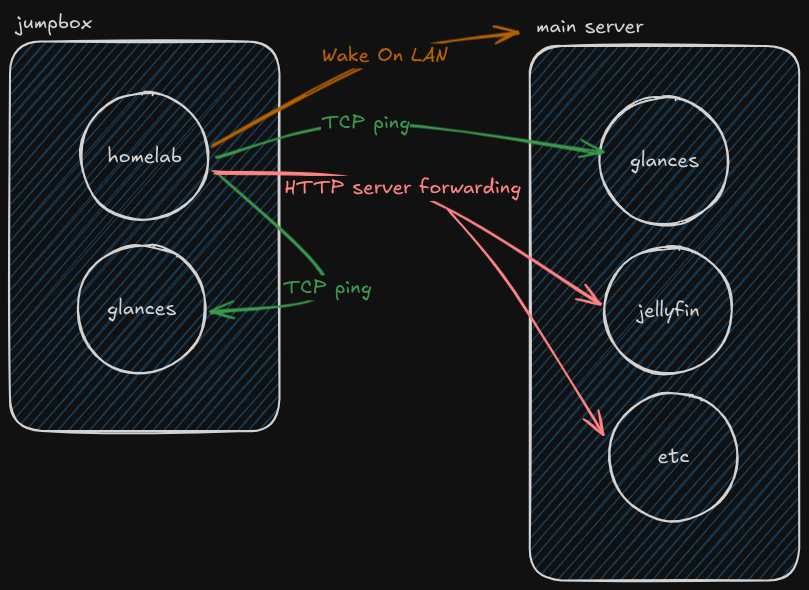

# homelab
_Monitor your homelab._

<p align="center">


</p>

## Features

- Application forwarding
- Server monitoring (requires [glances](https://github.com/nicolargo/glances) to be installed on host server)
- Administrator authentication using [better-auth](https://github.com/better-auth/better-auth)
- Easy deployment using docker-compose
- PWA integration for easy access on mobile
- Wake-on-LAN integration

## Server setup



In order to use this project, you should have a homelab set up. Homelab assumes
you have a simple jumpbox set up (this can be something like a Raspberry Pi) on
which this server is hosted. While you don't need to be connected via (virtual)
ethernet to connect to server apps, you _must_ have a (virtual) ethernet connect
to make use of the Wake-on-LAN functionality. WoL must be enabled in the
server's BIOS in order for the magic packet to work.

## Usage

This is a simple [fastify-vite](https://github.com/fastify/fastify-vite)
project. It uses React for the front-end.

### Using a container (PREFERRED)

Copy the example folder to your target destination, then follow the `README.md` for further instructions.

### Running from source

Clone the repo, then set up your configuration and authentication as described below. Prefer to use pnpm.

```sh
git clone $THIS_REPO
pnpm i
pnpm build
pnpm start
```

## Authentication

You **must** provide credentials on first run to register an administrator. To
do this, you must specify two environment variables:

```.env
ADMIN_EMAIL='test@foo.com'
ADMIN_PW='1234abc!!!'
```

These can be set on the command line, through the docker prompt, or in a .env
file.

It is recommended that you remove these environment variables on subsequent
runs. They will be securely stored in the local SQLite database for further use.

## Configuration Folder

The configuration is defined in a JSON file with the following structure:

### Apps Configuration
- `name` (required): Display name for the application.
- `host` (required): Display name of the server, as configured below.
- `port` (required): Host port number (0-99999)
- `path` (optional): Path to append to homelab dashboard URL.
- `hostPath` (optional): Path on the host machine.
- `icon` (optional): Icon svg, stored in config/public.

### Servers Configuration
- `name` (required): Display name for the server
- `ip` (required): IPv4 or IPv6 address
- `wakeOnLan` (optional): Wake-on-LAN settings
  - `macAddress` (required): MAC address in format `aa:bb:cc:dd:ee:ff`
  - `from` (default: "all"): Source IP or "all"
  - `interval` (default: 100): Interval between packets
  - `port` (default: 9): WoL port
  - `count` (default: 3): Number of packets to send
- `status` (optional): System monitoring settings
  - `apiPort` (default: 61208): Glances API port
  - `apiRoute` (default: "/api/4"): Glances API route

## Further work
- [ ] Front-end account creation / initialization workflow
- [ ] Server configuration in the dashboard
- [ ] App configuration in the dashboard
- [ ] Server-side integration? Potential for GUI-based management.
